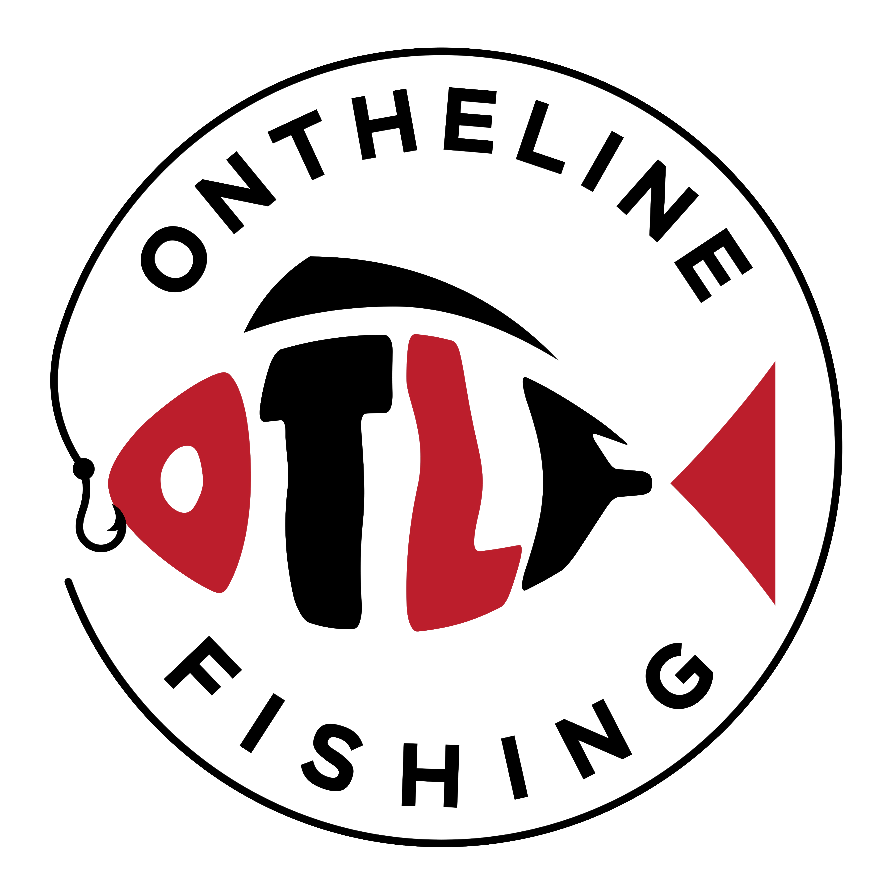

# OnTheLine

A fishing tool built by fishermen, for fishermen — to track catches and analyze shared data.

## Overview

OnTheLine is a backend-first application designed to:

- track fishing catches with location and metadata
- structure and store fishing data cleanly
- enable future data analysis and insights
- serve as a foundation for future web and mobile applications

## Architecture

The project follows a layered architecture to keep the codebase scalable and maintainable.

    OnTheLine/
    ├── app/
    │   ├── api/               # HTTP layer (Flask routes)
    │   ├── core/              # Domain logic & configuration
    │   ├── schemas/           # API data shapes
    │   ├── services/          # Application logic (use cases)
    │   ├── repositories/      # Data access layer
    │   └── main.py            # App entrypoint
    ├── docs/                  # Static assets (logo, media)
    ├── scripts/               # (future) utility scripts
    ├── tests/                 # (future) tests
    ├── LICENSE                # License
    ├── pyproject.toml         # Dependencies
    ├── uv.lock                # Lockfile
    └── README.md

## Data Flow

    Request → API → Service → Repository → Storage
                             ↓
                          Core (domain logic)

## Design Principles

- separation of concerns
- framework-independent core logic
- scalable structure
- incremental development

## Getting Started

Run the application from the project root:

    python -m app.main

Then open:

    http://127.0.0.1:5000

## Current Features

- [x] Catch domain model in core
- [x] Catch creation with validation
- [x] Flask API endpoints
- [x] Service layer
- [x] In-memory storage
- [x] Architecture separation (API / Service / Core / Schemas)
- [x] Catch lookup by ID

## To-Do

### Next Steps

- [ ] Add SQLite database
- [ ] Replace in-memory storage with persistent repository logic
- [ ] Implement SQLAlchemy models and database session setup
- [ ] Add update and delete endpoints
- [ ] Add filtering by species, location, or technique

### Future Ideas

- [ ] User system and authentication
- [ ] Fishing session tracking
- [ ] AI-based fish detection
- [ ] Weather and tide integration
- [ ] Data analytics dashboard
- [ ] Web client
- [ ] Mobile client

## Notes

This project is focused on building a clean backend architecture first, before expanding into frontend applications.

## License

See the LICENSE file for details.
